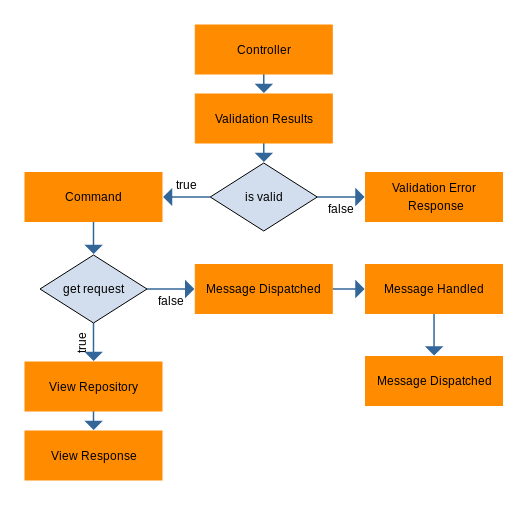

# Shop Api Plugin
The Shop Api Plugin is a plugin for the Sylius E-Commerce Platform which provides an easy integration for exposing the Sylius functionality to the end customer. One use-case would be if you want to run your shop without a frontend and maybe want to display the products and handle the cart flow in a mobile app. With this Plugin you just need to send simple Rest Requests to interact with Sylius.

## Shop Api vs. Admin Api
The default implementation provided by Sylius already implements an api containing a lot of features (called Admin Api). The Admin Api is more geared towards integrating other closed systems like a warehouse management system or similar. The reason behind that is that for the Admin Api you need to have to [exchange tokens to authenticate](https://docs.sylius.com/en/latest/cookbook/api/api.html) a new client for usage (which is based on oauth). On the other side in the Shop Api everyone can log into Sylius who has an account, no token exchange necessary. The Shop Api uses the [JWT](https://github.com/lexik/LexikJWTAuthenticationBundle) to authenticate its users.

## How does the Shop Api work

The general approach that Shop Api takes is that every request converts it into a specialized request class, validates it and turns it into a command with the `CommandProvider`. Then this command is either handled directly in the `Controller` (in case of a get route for example) and passed to the `ViewRepository` which returns a view. For requests that should change the system's state the command is dispatched and taken care of by one of the `MessageHandler`s.

### The Components
* **Request**: The Shop Api has its own request object. This object should abstract away the HTTP Request to a more general request type. Furthermore, it also acts as an object that can be validated as all validation rules are defined for the request objects only (commands are not validated)
* **Command**: The command class is an implementation agnostic class that holds the relevant data for handling the command.
* **Event**: The event class is an implementation agnostic class that holds the relevant data and inform system that something important happened in the application.
* **Handler**: The handler is the class that defines the logic of what happens when a certain command is called. Here we have the business logic.
* **ViewFactory**: The view factories are responsible for converting the entities into views.
* **Views**: Views are primitive objects that only hold scalars or other View objects which can be easily serialized (plain old php objects).
* **ViewRepository**: ViewRepositories are repositories that return view objects from the entities they are fetched.

> ViewRepositories are **not** repositories of views which means they don't save views and can not be used for caching.

### Command - Handler Structure
Command handling has multiple parts to it. When dispatching a command, the `MessageBus` looks for a handler that has an `__invoke` method with the parameter type matching the type of the command that was dispatched. Before and after the handler is executed, there is a way for a "Middleware" to be executed (see below). The CommandHandler itself, however, does not return anything (this is not a technical limitation that is just the convention we chose in Shop Api).

All Middlewares which are executed are defined under the `framework.messenger` bundle: [config.yml](https://github.com/Sylius/ShopApiPlugin/blob/fc25f36274e6add118f5b575a44db81bcc47b2e5/src/Resources/config/app/config.yml#L17)

> Important: The entities that were loaded from the `EntityManager` and changed in the `CommandHandler` are flushed in the Middleware (which configured in the `doctrine_transaction` middleware). More information about the Middleware works in from the Symfony Messenger Bundle can be found [here](https://symfony.com/doc/current/components/messenger.html#bus).

### Event - Handler Structure
In vanilla Sylius, one may use ResourceControllerEvents to integrate with external services (e.g. send an email to customer or 
inform ERP about new order). As ShopAPI provides different approach of handling customer intention (For more info, please check 
[How does the Shop Api work](#How does the Shop Api work)), different approach for integration will be needed as well.

In contrast to commands, events may have 0 or multiple handlers in the system. Behaviour of events is same as controllers, while the purpose is totally different.
Events are broadcasted through the application and are meant to be an integration point for external application, therefore there are only triggered when change
is successfully saved in the database.

At this moment following events are triggered in system:

* Sylius\ShopApiPlugin\Event\CartPickedUp
* Sylius\ShopApiPlugin\Event\OrderCompleted

More events will be introduced to ShopAPI with the time.

More information about this approach may be found [here](https://symfony.com/doc/current/messenger/message-recorder.html).

> Important: `Sylius\ShopApiPlugin\Event\CustomerRegistered` is old styled SymfonyEvent which is triggered in `Sylius\ShopApiPlugin\Handler\Customer\RegisterCustomerHandler` and behaves differently. This class has been left due to Backward Compatibility but will be migrated to the new approach with time. 

### Generated Parameters
In the Shop Api you will come across parameters like this `%sylius.shop_api.view.customer.class%`. Those are generated by the Shop Api when the container is compiled. Originally they are configured in the `sylius_shop_api.yml` file. If this file does not override the default values which are defined in the file `src/DependencyInjection/Configuration.php`. This is also a place where new view class configurations and request configurations have to be added.

### Serializer
The Serializer is the interface between the view object that the Shop Api defines and the the response that Symfony generates. By default the Serializer is configured to deliver two kinds of formats: **json and xml**, json is the preferred way.

When rendering a View with the ViewHandler, **it will only serialize properties of the view object which are not null**. If you want to render some properties only on a certain endpoint, then you need to define a Serialization group. This can be done in a yaml file in the `src/Resources/config/serializer/` folder. More information on how to configure the serializer can be found on the [serializer bundle's page](https://jmsyst.com/libs/serializer)

## Extending Shop Api

### Extending requests / commands
The easiest way to extend the existing request classes and add new properties is to inherit from the Shop Api Object. There you need to change the constructor to extract the additional information from the request and then also override the corresponding command class. For example adding a locale to the coupon:

```php
use Sylius\ShopApiPlugin\Request\Cart\AddCouponRequest;
use Symfony\Component\HttpFoundation\Request;
use Sylius\ShopApiPlugin\Command\CommandInterface;

final class AddLocalizedCouponRequest extends AddCouponRequest
{
    /** @var string */
    protected $locale;

    protected function __construct(Request $request)
    {
        parent::__construct($request);

        $this->locale = $request->getLocale();
    }

    public function getCommand(): CommandInterface
    {
        return new AddLocalizedCoupon($this->token, $this->coupon, $this->locale);
    }
}
```
In the same manner the command would need to be created and extending from the `AddCoupon` class. To change the flow from using the Shop Api request and command object to your own structure you only need to change one parameter in the configuration under the `sylius_shop_api.yml` like so:
```yml
sylius_shop_api:
    request_classes:
        add_coupon: \AddLocalizedCouponRequest
```

### Extending handlers
The main way to extend a handler is to decorate it. This makes adding functionality before and after the handler easy. However, if you want to change the logic in the handler, you need to overwrite it. This can be done by registering the new handler with the same service id. 
> Do not just add it with a new service id otherwise, it will execute both handlers.

### Extending views
When extending the views, three places need to be modified, the view class, the view factory, and the view repository (if there are any).

ViewFactories, as well as the ViewRepositories, can be either completely replaced or the preferred way of doing it if you only want to add features to it, decorate the classes.

```php
use Sylius\Component\Order\Model\OrderInterface;
use Sylius\ShopApiPlugin\Factory\Cart\TotalViewFactory;

class NiceTotalViewFactory implements TotalViewFactoryInterface
{
    private $innerTotalViewFactory;

    public function __construct(TotalViewFactoryInterface $innerTotalViewFactory)
    {
        $this->innerTotalViewFactory = $innerTotalViewFactory;
    }

    public function create(OrderInterface $order): NiceTotalView
    {
        /** @var NiceTotalView $totalView */
        $totalView = $this->innerTotalViewFactory->createNew();

        $totalView->nicePersonDiscount = $orderInterface->getNiceDiscount();

        return $totalView;
    }
}
```
and this is configured like this (xml is used for reference yaml works as well):
```xml
<service class="NiceTotalView"
         id="app.factory.nice_total_view_factory"
         decorates="sylius.shop_api_plugin.factory.total_view_factory">
    <argument type="service" id="app.factory.nice_total_view_factory.inner" />
</service>
```
and to change the view class in sylius:
```yml
sylius_shop_api:
    view_classes:
        total: \NiceTotalView
```

You have to extend the base view class in order to match view factory type hint.
```php
class NiceTotalView extends TotalView
{
    /** @var float */
    public $nicePersonDiscount;
}
```

One other thing to keep in mind when working with the API and creating new views is that the endpoints that return multiple resources (for example a list of products) are usually paginated. Pagination in the shop api is implemented with the plugin [Pagerfanta](https://github.com/whiteoctober/Pagerfanta) which needs besides the attributes that it should serialize on the product also a key relations like the route to the individual products. The current object you are serializing is in the object "variable" and can be used with the expression syntax as shown below:
```yml
relations: 
    - rel: self
    - href:
        route: sylius_shop_api_product_show_details_by_slug
        parameters:
            slug: expr(object.slug)
```
If you customize the product route you might also need to change those configurations.

### Custom Channel Handlers
The default way that Sylius tries to resolve channels is through the hostname. However, if you want to add your own way of resolving a channel, for example from a route parameter, you need to do two things:

1. Create a class that resolves the URL to a channel

```php
use Sylius\Component\Channel\Context\ChannelContextInterface;
use Sylius\Component\Channel\Repository\ChannelRepositoryInterface;
use Sylius\Component\Channel\Model\ChannelInterface;
use Sylius\ShopApiPlugin\Exception\ChannelNotFoundException;
use Symfony\Component\HttpFoundation\RequestStack;
use Webmozart\Assert\Assert;

class RequestAttributeChannelContext implements ChannelContextInterface
{
    private $channelRepository;
    private $requestStack;

    public function __construct(ChannelRepositoryInterface $channelRepository, RequestStack $requestStack)
    {
        $this->channelRepository = $channelRepository;
        $this->requestStack = $requestStack;
    }

    public function getChannel(): ChannelInterface
    {
        $request = $this->requestStack->getMasterRequest();
        try {
            $channelCode = $request->attributes->get('channelCode');
            Assert::notNull($channelCode);
            return $this->channelRepository->findOneByCode($channelCode);
        } catch(\Exception $e) {
            throw new ChannelNotFoundException();
        }
    }
}
```

2. Register the class as a channel context
```xml
<service id="sylius.context.channel.request_attribute_based" class="RequestAttributeChannelContext">
    <argument type="service" id="sylius.repository.channel" />
    <argument type="service" id="request_stack" />

    <tag name="sylius.context.channel" priority="100" />
</service>
```

### Triggering additional logic after order has been placed

In order to inform your external system about an order placed with ShopAPI 

1. Create a class that will execute your business logic

```php
<?php

use Sylius\ShopApiPlugin\Event\OrderCompleted;

final class OrderCompletedListener
{
    public function __invoke(OrderCompleted $orderCompleted): void
    {
        // Your custom logic        
    }
}
```

2. Register the class as event handler
```xml
<service
    id="app.event_listener.order_completed_listener"
    class="App\EventListener\OrderCompletedListener"
>
    <tag name="messenger.message_handler"  bus="sylius_shop_api_plugin.event_bus"/>
</service>
```

### Handling Payments via API
**Currently the API does not support any kind of payments.** A simple way to implement this is to define an endpoint that will take the payment data and process it in Sylius. One approach here is to make all payments in Sylius "offline payments" so that the api can handle this manually.
